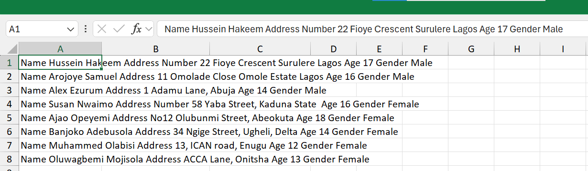
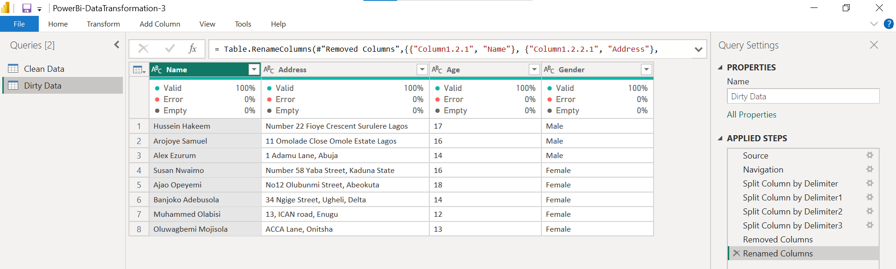
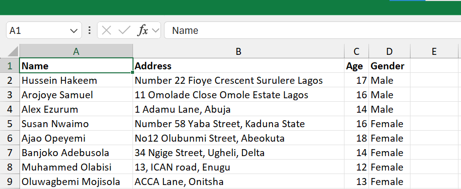

# 📊 Power BI Data Transformation Challenge #3

Transforming unstructured text data into a clean, analysis-ready dataset using Power Query in Power BI.

---

## 🔴 Raw Dataset

### Challenge
- Data stored in a single text field
- No structured columns
- Difficult to analyze and report

---

## 🔵 Power Query Transformation

### Transformations Applied
- Split Column by Delimiter
- Removed Unnecessary Columns
- Renamed Columns
- Structured Data Formatting

---

## 🟢 Clean Dataset

### Result
- Name extracted into a separate column
- Address extracted into a separate column
- Age extracted into a separate column
- Gender extracted into a separate column
- Clean and structured dataset ready for analysis

---

## 📚 How to Recreate This Transformation

1. Download Excel data file "3-Jumbled-up-Customers-Details"
2. Load the dataset into Power BI.
3. Open Power Query Editor.
4. Select the column containing the combined text.
5. Use **Split Column by Delimiter** multiple times to separate Name, Address, Age, and Gender.
6. Remove unnecessary columns created during the transformation.
7. Rename the final columns appropriately.
8. Verify the data structure.
9. Close & Apply.
10. Save The File Using "Save As"
   
---

## 🛠 Tools Used

- Microsoft Excel
- Power BI
- Power Query

---

## 🚀 Outcome

Successfully transformed unstructured text data into a clean, structured, and analysis-ready dataset using Power Query.

---

⭐ If you found this project useful, consider giving the repository a star.
